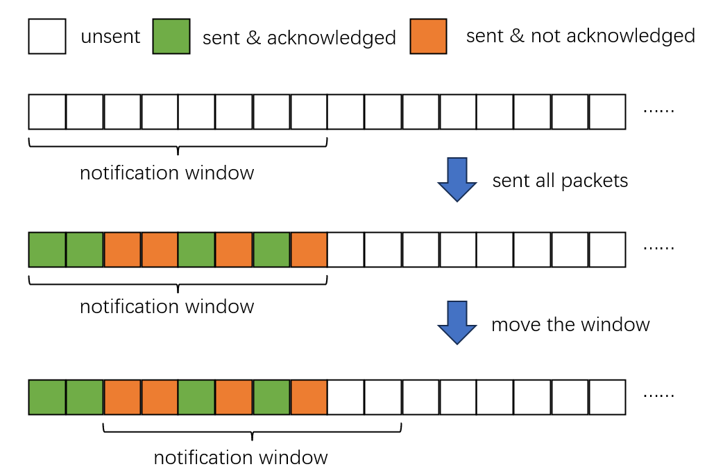

# CS305-2024Spring-FinalProject: Reliable Data Transfer upon UDP

**Team member: 黄弋骞 12012911; 刘腾飞 11911720**

The original template code is available at: https://github.com/SUSTech-HPCLab/CS305-2024Spring-FinalProject.

The code can now pass Testcases 0-15.

**Implemented features:**
1. three-way handshake and waving four times
2. send and receive with loss, corruption, and delay
3. retransmitting
4. checksum verification
5. big file transmission and file chunking
6. pipeline manner (including flow control & congestion control)
7. Demultiplexing

## How to run

1. **Connect to the SUSTech network.** You should connect your machine to the SUSTech campus network, so that the proxy server at `10.16.52.94` is reachable.
2. **Configure IP addresses.** You should edit `ip.py` to ensure that `sender_address` and `receiver_address` correctly correspond to the address of your machine (no need to edit the port number).
3. **Generate the data file.** When testing cases 5-15, the sender will send a file named `original.txt` (size=100KB). So, you should first generate this text file in the root path. This can be done by running `file_generate.py`.
4. **Run the test.** Run `testcase.py`, which will test all 16 testcases. If a test case passes, a message like ``test case 0 pass`` will be printed at the end.

**Local test.** For local testing, you should first edit `ip.py` (per the commented part) and run `proxy.py` in the background. Then, you can run `test_case.py`.

## Processing

### Overview

The environment creates two instances of `RDTSocket()` as a sender and a receiver, respectively. Once they are created and ready, the sender invokes the `connect()` function, by which the sender and receiver perform the three-way handshake process to establish a connection.

After that, the sender uses the `send()` function to send a string of data (a short message or the content of the text file `original.txt`) to the receiver. Upon completion of sending, the sender will invoke `close()` to send a FIN packet. For the receiver, it will receive all data before receiving a FIN packet. After a FIN packet is received, the sender and receiver carry out the waves-four-times process to close this connection.

### Connection Establishing

In the provided code, the three-way handshake and four-way handshake are implemented to establish and terminate connections respectively. The three-way handshake involves the client sending a SYN packet, the server responding with a SYN-ACK packet, and the client completing the handshake with an ACK packet. This process is implemented in the `connect` method for the client and the `accept` method for the server. 


For connection termination, the four-way handshake is used, where the initiator sends a FIN packet, the receiver responds with an ACK, then sends its own FIN, and the initiator completes the termination with an ACK. This is implemented in the `close` method. The `accept` method listens for incoming data, extracts headers, and handles SYN and ACK packets to establish connections. The connect method sends a SYN packet, waits for a SYN-ACK, and responds with an ACK. For termination, the `close` method handles sending and receiving FIN and ACK packets to ensure a clean connection closure. This ensures reliable connection setup and teardown in the RDT protocol.

### Checksum Verification

We have embedded the checksum verification in the `to_bytes()` and `from_bytes()` functions. When invoking `to_bytes()`, the checksum of the current packet is always computed and joined to the byte data; when invoking `from_bytes()`, the checksum is always extracted and verified. If the checksum is incorrect, the function will raise a `ValueError`, which can be captured by the upper socket functions.

### Demultiplexing

Demultiplexing in our RDT protocol is implemented in the `accept` method, which handles multiple client connections and isolates their data. The method listens for incoming data using `recvfrom` and extracts the header information with RDTHeader().from_bytes(data). If a SYN message is received (header.SYN == 1 and header.ACK == 0), the server responds with a SYN-ACK message. When a SYN-ACK message is received (header.SYN == 0 and header.ACK == 1), the server increments the connection count and stores the client's address in self.connections. __This process continues until the desired number of connections (connect_num) is reached__. By using `self.connections` to store client addresses and a loop to listen for data, the server can handle multiple connections simultaneously, ensuring that each client's data is isolated and properly managed.

### Big data transmission

When transmitting the data string with $size=k~\text{bytes}$, the sender splits the string into $\lceil\frac{k}{256}\rceil$ chunks. For the $i$-th chunk, the sender compresses it into a packet with `SEQ_num=i` and sends it to the receiver. When the receiver receives this packet, it will store the data in the $i$-th bucket of the receiver's buffer, and send back an acknowledgment packet with `ACK_num=i`. Upon completion of sending, the receiver will organize the data by the order of the bucket, thus preventing data disorder. **Note that, if the receiver does not receive the packet for $i$-th chunk or receives a corrupted one, it will not send back any acknowledgment and then wait for the sender's retransmission.**

### Pipeline manner

For the sender, we have implemented the pipeline manner **in single-thread mode**, where the sender can send subsequent packets without confirmation of ACK responses of previous packets.

Specifically, we maintain a notification window with `window_size=8` and send the packets round by round. In each round, the sender first sends all unsent packets in the window, then uses the **non-blocking** `recvfrom()` to receive all returned ACK packets **in the socket receive buffer**. Based on the returned packets, the sender moves the window towards new unsent packets. This process proceeds until all packets is sent. **This way, new packets in the notification window can be sent immediately without waiting for previous acknowledgment responses.** The figure below illustrates this process.



### Retransmission

As shown in the figure, in the notification window, all unacknowledged packets will be resent in the next round. This process avoids waiting for the timeout and ensures that no packet will be lost in the end.

### Congestion control

We have implemented congestion control by monitoring the packet loss rate and dynamically adjusting the window size. Specifically, at the end of each round of transmission, the sender computes the loss rate as $\frac{\text{number of sent but unacknowledged packets}}{\text{window size}}$. If the loss rate is larger than half of the window size, the sender decreases the window size by one-half. In the next round, if the loss rate is still larger than half of the window size, the window size is decreased similarly, until the size becomes 0. Otherwise, the window size is doubled. By doing this, the speed of transmission will be reduced when the loss rate becomes high and will be increased when the loss rate is low. The code is shown below:

```python
if window_size > 0 and loss > window_size / 2:
	window_size = window_size // 2
else:
	if window_size < 8:
		window_size = 1 if (window_size == 0) else window_size * 2
```